Introduction
============

This guide will walk you through installing & using the C24 iO Mule Connector in the Mule Anypoint Studio.

The current C24 Connector will allow you to use any C24 iO 1:1 transform in your Mule flows, optionally parsing and validating in the process. You can combine any of Mule's endpoints and processing components to ingest, route, parse, validate, transform and write messages to create scalable, fault tolerant and highly available message processing systems.

Although it assumes no prior knowledge of Maven, under the hood Maven is used to manage the dependencies, build & run your Mule application. You may wish to refer to the documentation at <http://maven.apache.org/> for more details. 

Installing the C24 iO Mule Connector
====================================

The C24 iO Mule Connector is installed in the same way as any other Mule Connector.

In Anypoint Studio, select the Help->Install New Software... menu item:

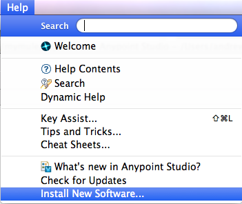

In the wizard click "Add..." to create a new repository. Pick an appropriate name and set the location to "http://dev.c24.biz/mule/update-site", then click OK.

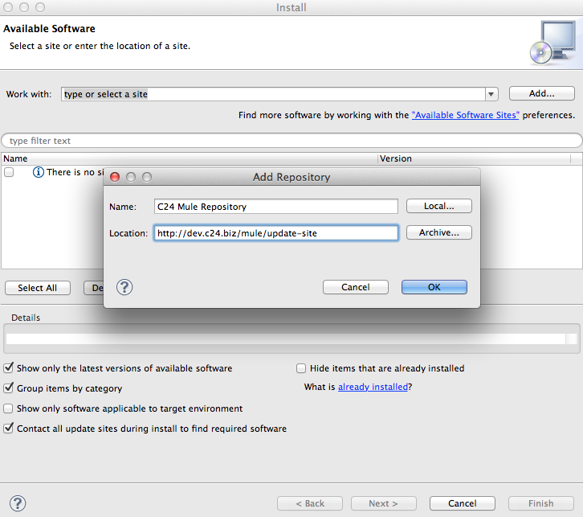

Select your newly created repository from the "Work with:" drop down and you'll see the C24 Mule Connector available to install:

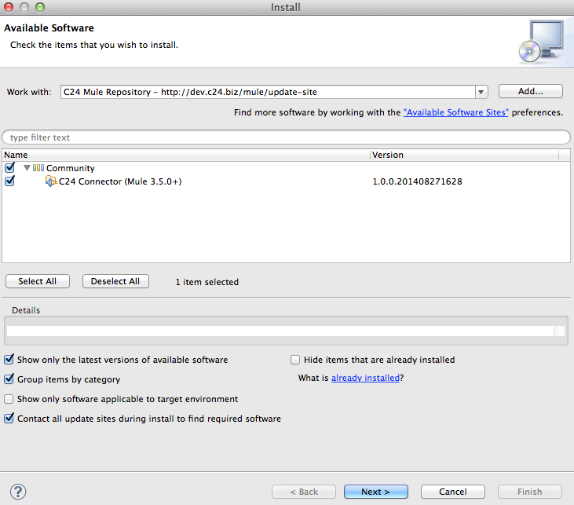

Click through the wizard and accept the licence agreement to install the connector.

Using the C24 iO Mule Connector
===============================

## Creating a Mule Maven Project

The C24 Mule Connector requires that you use a Mule Maven project.  
Inside the AnyPoint Studio, create a new Mule Project:

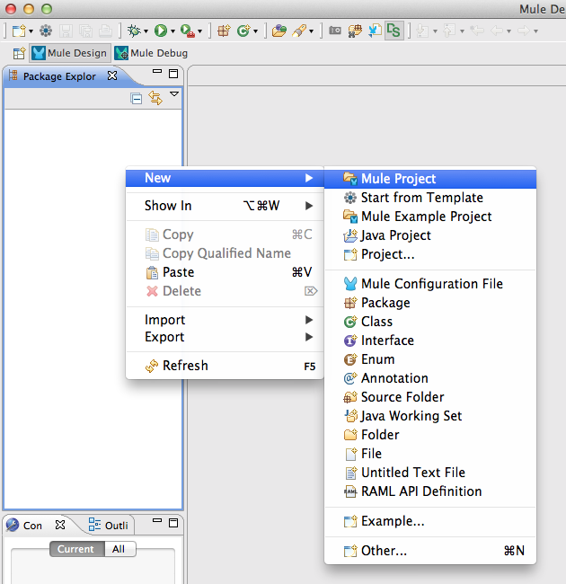

In the new project wizard, select to use Maven and populate the groupId, artifactId and version appropriately:

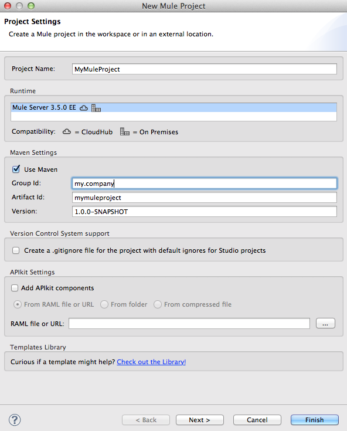

Configure the project as required and finish the wizard.

## Adding C24 iO to the Project

The C24 Mule Connector does not bundle a version of iO to allow you to select and upgrade versions as desired. Consequently we need to update the project's pom.xml to configure iO.

First we need to tell Maven where it can find the C24 iO jars. Unless you host them in your own Maven repository, you'll probably want to use the C24 Nexus. Open up the project's pom.xml and add the following to the _repositories_ section:

        <repository>
            <id>c24</id>
            <name>C24 Maven Repository</name>
            <url>http://repo.c24io.net/nexus/content/repositories/releases</url>
        </repository>
        
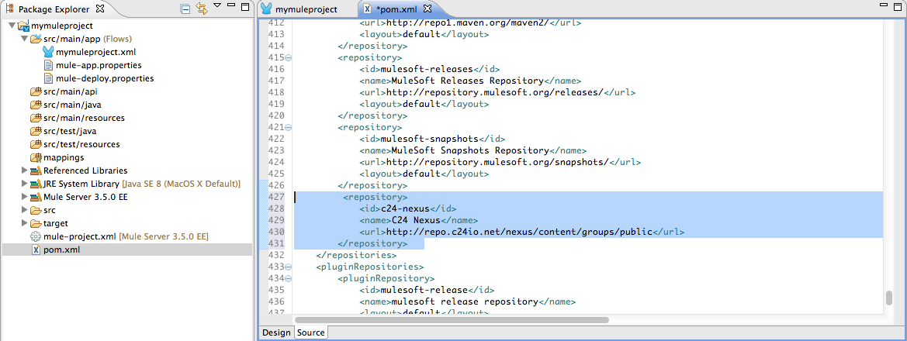

Next we need to add the C24 Runtime jars to the project's dependencies. Add the following to the _dependencies_ section, updating the version as appropriate:

        <dependency>
            <groupId>biz.c24.io</groupId>
            <artifactId>c24-io-api</artifactId>
            <version>4.6.5</version>
        </dependency>
        
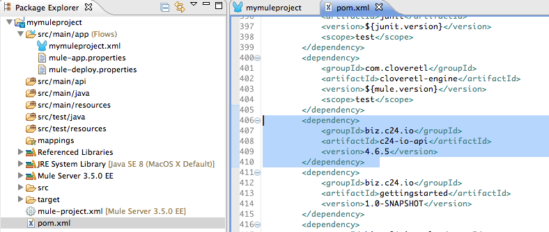     

You've now wired in C24 iO!
    

### Adding your custom models and transforms

Next we need to add the generated C24 iO jars for any transforms or models you wish to use in your flow. 

You may already be hosting these files in your own Maven repository. If not, good practice is to create a Maven repository as part of your project - that way when others check it out they will also get your jars. There are many guides to this on the web (such as <https://devcenter.heroku.com/articles/local-maven-dependencies>) however please contact C24 if you need further assistance.

Once you've put your jars into a repository (and added any necessary configuration to the _repositories_ section in the pom.xml) we need to declare them as project dependencies. Add a _dependency_ in the pom.xml's _dependencies_ section for them exactly as we did for the C24 Runtime jars. For example (your dependencies will differ):

Remember that if your transform and models are in separate jars, you'll need to add a _dependency_ for each of them.

## Creating a Global Configuration

The C24 Connector uses a global configuration to make available transforms and licensing.

Open your application's flow, select the _Global Elements_ tab at the bottom and click the _Create_ button. In the pop-up window, open _Connector Configuration_ and select _C24 Connector_ then click _OK_.

The Connector configuration supports DataSense, which will scan your classpath for C24 iO transforms to make it easier to configure your connectors later on however this can take some time if you have a large classpath. Deselect the _Enable DataSense_ option to disable this.

If you are using licensed models (such as SWIFT) then at runtime iO will need a valid licence file. Please see <http://dev.c24.biz/api_javadoc/4.6/biz/c24/io/api/C24.html#withLicence(java.lang.String)> for details on how the parameter entered here will be interpreted.

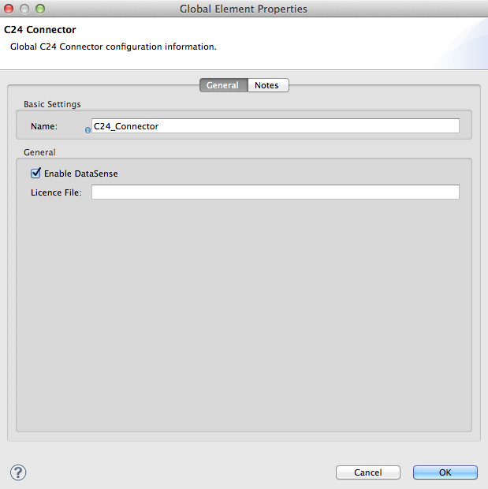

## Adding the Connector to a flow

You're now ready to start adding instances of the C24 Connector to your flows.

Drag and drop the connector to the appropriate point in the flow then double-click it to bring up its properties:

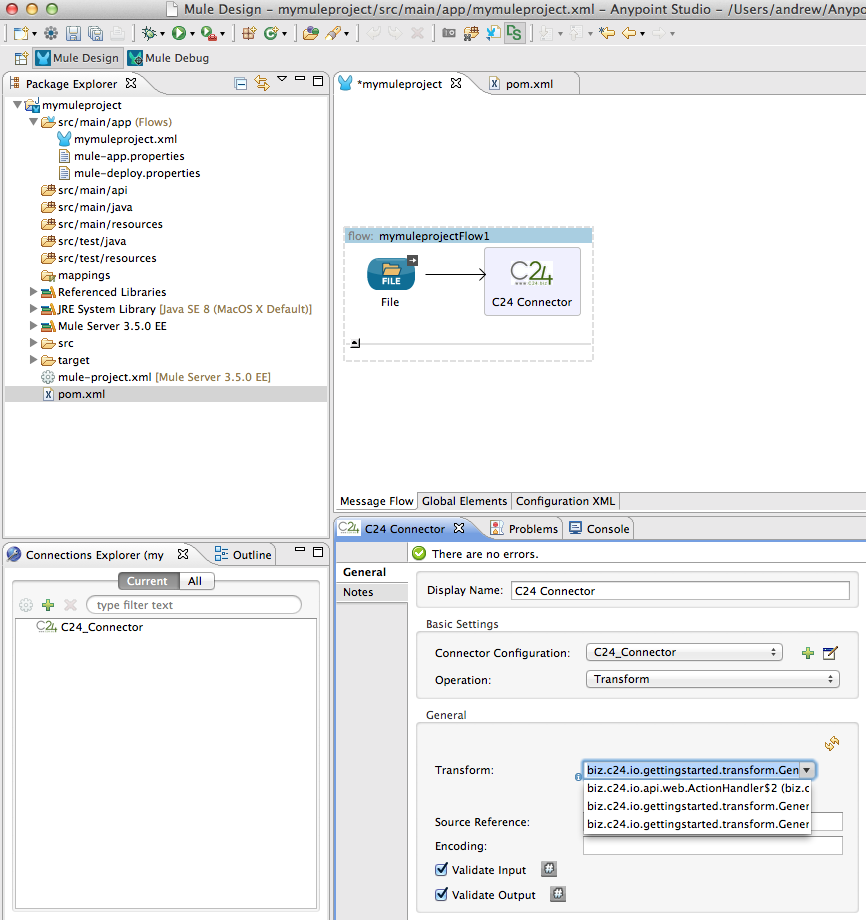

Under _Basic Settings_ -> _Connector Configuration_ select the global configuration that you just created.

If you enabled DataSense, the _Transform_ drop down will be populated with the available transforms in your classpath - if not you can manually type in the fully qualified class name of the transform that you wish to use. If you are using DataSense and change your project dependencies, click the _Refresh_ icon to the top-right of the drop down to rescan the classpath.

_Source Reference_ defaults to using the payload of the inbound message. Under normal circumstances it's unlikely that you'll want to change this.

When you created your iO models, you will have selected the default encoding that their wire format uses. If you wish to override it, you can set the _Encoding_ parameter to the correct character set.

If the Connector receives a wire-format message it will attempt to parse it according to the input format expected by the transform. If you wish to use iO's semantic validation (in addition to the syntactical validation provided during parsing), select the _Validate Input_ check box.

Equally, semantic validation can be applied to the result of the transform before it is handed off to the next component in the flow - select the _Validate Output_ check box to enable this.

You can then connect other processing components and endpoints to the output of the Connector. The sample below reads messages from a file, transforms the contents and writes the result back to a file.

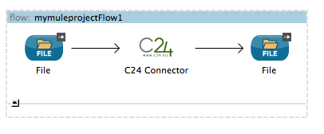

Any errors during the connector's processing (such as parsing, transformation or validation errors) will result in a _C24Exception_ being thrown.

## Running the Application

Once you have completed implementing your flow, you can run it from within Anypoint Studio.

Right click on your flow in the _Package Explorer_ and select _Run As_ -> _Mule Application with Maven_

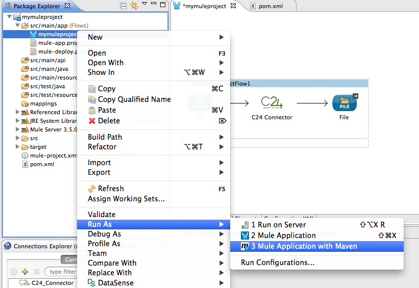