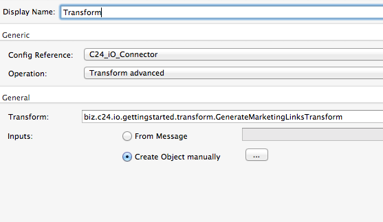
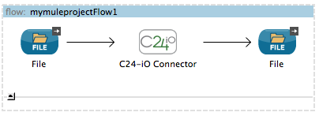

Introduction
============

This guide will walk you through installing & using the C24-iO Mule Connector in the Mule Anypoint Studio.

The C24-iO Mule Connector enables you to use core C24-iO functionality and your generated models and transforms in your Mule flows. 

The current connector provides operations to parse, validate, transform and marshal messages. Additionally it provides a one-shot 'convert' operation which combines these capabilities into a single invocation. You can combine any of Mule's endpoints and processing components to ingest, route, parse, validate, transform and write messages to create scalable, fault tolerant and highly available message processing systems.

Although it assumes no prior knowledge of Maven, under the hood Maven is used to manage the dependencies, build & run your Mule application. You may wish to refer to the documentation at <http://maven.apache.org/> for more details. 

Installing the C24-iO Mule Connector
====================================

The C24-iO Mule Connector is installed in the same way as any other Mule Connector.

In Anypoint Studio, select the _Help_ -> _Install New Software..._ menu item:

In the wizard click _Add..._ to create a new repository. Pick an appropriate name and set the _Location_ to "http://dev.c24.biz/mule/update-site", then click _OK_.

Select your newly created repository from the _Work with_ drop down and you'll see the C24-iO Mule Connector available to install:

Click through the wizard and accept the licence agreement to install the connector.

Using the C24-iO Mule Connector
===============================

## Creating a Mule Maven Project

The C24-iO Mule Connector requires that you use a Mule Maven project.  
Inside the AnyPoint Studio, create a _New_ -> _Mule Project_:

In the new project wizard, select _Use Maven_ and populate the _Group Id_, _Artifact Id_ and _Version_ appropriately:

Configure the project as required and finish the wizard.

## Adding C24-iO to the Project

The C24-iO Mule Connector does not bundle a version of iO to allow you to select and upgrade versions as desired. Consequently we need to update the project's pom.xml to configure iO.

First we need to tell Maven where it can find the C24-iO jars. Unless you host them in your own Maven repository, you'll probably want to use the C24 Nexus. Open up the project's pom.xml and add the following to the _repositories_ section:

        <repository>
            <id>c24</id>
            <name>C24 Maven Repository</name>
            <url>http://repo.c24io.net/nexus/content/repositories/releases</url>
        </repository>
        

Next we need to add the C24-iO Runtime jars to the project's dependencies. Add the following to the _dependencies_ section, updating the version as appropriate:

        <dependency>
            <groupId>biz.c24.io</groupId>
            <artifactId>c24-io-api</artifactId>
            <version>4.6.5</version>
        </dependency>
        
     

You've now wired in C24 iO!
    

### Adding your custom models and transforms

Next we need to add the generated C24-iO jars for any transforms or models you wish to use in your flow. 

You may already be hosting these files in your own Maven repository. If not, good practice is to create a Maven repository as part of your project - that way when others check it out they will also get your jars. There are many guides to this on the web (such as <https://devcenter.heroku.com/articles/local-maven-dependencies>) however please contact C24 if you need further assistance.

Once you've put your jars into a repository (and added any necessary configuration to the _repositories_ section in the pom.xml) we need to declare them as project dependencies. Add a _dependency_ in the pom.xml's _dependencies_ section for them exactly as we did for the C24-iO Runtime jars. For example (your dependencies will differ):

Remember that if your transform and models are in separate jars, you'll need to add a _dependency_ for each of them.

## Creating a Global Configuration

The C24-iO Connector uses a global configuration to make available transforms and licensing.

Open your application's flow, select the _Global Elements_ tab at the bottom and click the _Create_ button. In the pop-up window, open _Connector Configuration_ and select _C24-iO Connector_ then click _OK_.

If you are using licensed models (such as SWIFT) then at runtime iO will need a valid licence file. Please see <http://dev.c24.biz/api_javadoc/4.6/biz/c24/io/api/C24.html#withLicence(java.lang.String)> for details on how the parameter entered here will be interpreted.

## Adding the Connector to a flow

You're now ready to start adding instances of the C24-iO Connector to your flows.

Drag and drop the connector to the appropriate point in the flow then double-click it to bring up its properties:

Under _Basic Settings_ -> _Connector Configuration_ select the global configuration that you just created.

### Operation: Parse

The Parse operation takes a message in its source format and parses it to create a Java-bound version of the message. A _C24Exception_ will be thrown if the message cannot be parsed.

Parameter        | Details                                                      | Required
-----------------|--------------------------------------------------------------|---------
Type             | The fully-qualified classname of the type of object to parse | Yes
Source Reference | Where to read the message from                               | No. Defaults to inbound payload
Encoding         | The character encoding used by the source message            | No. Defaults to model's default character set
Format           | The textual format of the inbound message                    | No. Defaults to model's default input format.

The parse operation can parse to both C24 CDO & SDOs depending on the type of class specified in the _Type_ parameter.

### Operation: Validate

The Validate operation applies your configured C24-iO validation rules to determine if the parsed message passed to it is valid. If it is, the message will be passed on as the output from the operation; if not a _C24Exception_ will be thrown.

There is no configuration required for the Validate operation although the _Source Reference_ can be overriden if required.

Parameter        | Details                                           | Required
-----------------|---------------------------------------------------|---------
Source Reference | Where to read the message from                    | No. Defaults to inbound payload

### Operation: Transform

The Transform operation invokes a C24-iO 1:1 transform, using the object output from it as its output payload.

Parameter        | Details                                               | Required
-----------------|-------------------------------------------------------|---------
Type             | The fully-qualified classname of the transform to use | Yes
Source Reference | Where to read the message from                        | No. Defaults to inbound payload.

Errors during transformation will result in a _C24Exception_ being thrown however neither the input nor the output are validated - you can chain additional instances of the _C24-iO Connector_ with the validate operation in your flows to achieve this.

### Operation: Transform Advanced

The advanced version of the transform operation is for n:m C24-iO transforms. 

Parameter        | Details                                                           | Required
-----------------|-------------------------------------------------------------------|---------
Type             | The fully-qualified classname of the transform to use             | Yes
Inputs           | Select _Create Object manually_ and follow the instructions below | Yes

In the Create Object dialog, add one entry for each input that the transform expects. C24-iO will attempt to coerce supplied values into the correct type required by the transform. To map the inbound payload to an input, use the value _#payload_.

The output from the operation is a List of Lists; these lists are constructed according to the definition of your transform.

### Operation: Marshal

The marshal operation converts a C24-iO object to its raw (textual) format. 

Parameter        | Details                             | Required
-----------------|-------------------------------------|---------
Source Reference | Where to read the message from      | No. Defaults to inbound payload
Encoding         | The character encoding to use       | No. Defaults to model's default character set
Format           | The format of the outbound message  | No. Defaults to model's default output format.

If you choose to override the default output format, C24-iO will dynamically generate a representation in your selected format.

Errors during marshaling will result in a _C24Exception_ being thrown.

### Operation: Convert

The convert operation chains all of the above operations together to provide a simple one-step mechanism to parse, validate, transform 1:1 and marshal messages. If you don't need the flexibility of the individual operations or to insert additional logic within this sequence, it is the most concise way to process your messages. 

Parameter        | Details                                                      | Required
-----------------|--------------------------------------------------------------|---------
Transform        | The fully-qualified classname of the transform to use        | Yes
Source Reference | Where to read the message from                               | No. Defaults to inbound payload
Encoding         | The character encoding used by the source message            | No. Defaults to model's default character set
Validate Input   | Whether the inbound message should be validated              | No. Defaults to true
Validate Output  | Whether the output of the transform should be validated      | No. Defaults to true

You can then connect other processing components and endpoints to the output of the Connector. The sample below reads messages from a file, transforms the contents and writes the result back to a file.

### Error Handling

Any C24-iO exceptions during the connector's processing (such as parsing, transformation or validation errors) will result in a _C24Exception_ being thrown.

## Running the Application

Once you have completed implementing your flow, you can run it from within Anypoint Studio.

Right click on your flow in the _Package Explorer_ and select _Run As_ -> _Mule Application with Maven_

